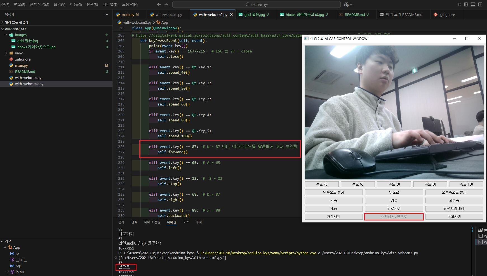

# GRID 방식의 레이아웃 활용 결과
### 웹캠을 통하여 자동차의 Grid 레이아웃을 미리 설정해 보았는데 원하는 화면의 배치가 적절하지 않아서 밑에있는 BOX 형식의 레이아웃으로 수정하였습니다.

# BOX 방식의 레이아웃 활용 결과
### Grid 레이아웃에서 Box 형식으로 전환뒤 각각의 키입력을 아스키코드랑 키설정을 하여 화면에 보이는 현재상태에 동작을 추가하였습니다.

# W 키 입력 눌렀을때 화면입니다.
